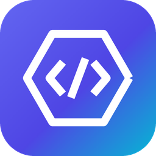

<div align="center">



# IL2CPP Dumper Studio

**Turn a Unity Android APK into readable C#.**

A complete, dependency-free IL2CPP dumper for Android builds — with a modern
web studio, a Google-Colab notebook, a CLI, and an on-device Android app.

**Developed by Mohamed Annati**

[Quick start](#quick-start) · [Web studio](#web-studio) · [Colab](#google-colab) · [CLI](#command-line) · [Android](#android-app) · [Outputs](#outputs)

</div>

---

## What it does

Upload **`libil2cpp.so` + `global-metadata.dat`** — or just the **`.apk` / `.xapk` / `.aab`** —
and get back everything a reverse-engineer needs:

| Output | Purpose |
|---|---|
| `dump.cs` | C# pseudo-code of every type: methods, fields, properties, events, RVAs, field offsets |
| `DummyDll/` | Rebuilt .NET assemblies you can open in **dnSpy / ILSpy** |
| `il2cpp.h` | Runtime structures + ECMA-335 constants for **IDA / Ghidra** |
| `script.json` | Symbol + string table to auto-rename everything in IDA / Ghidra |
| `stringliteral.json` | Every managed string literal in the game |
| `dump-manifest.json` | Machine-readable summary of the run |

The core is **pure Python** (no dependencies). It parses metadata versions **16–31**,
supports **ELF32/ELF64** (`armeabi-v7a`, `arm64-v8a`, `x86`, `x86_64`) and **PE**
(`GameAssembly.dll`), applies relocations, locates the `CodeRegistration` /
`MetadataRegistration` tables (symbol *and* heuristic search), resolves the full
`Il2CppType` table (generics, arrays, pointers, by-refs), and rebuilds valid
ECMA-335 assemblies.

If the native binary can't be analysed (encrypted metadata, packed `.so`), it
gracefully falls back to **metadata-only mode** and still produces a useful
`dump.cs` — and tells you exactly why.

---

## Quick start

```bash
git clone https://github.com/Mohamed2020p/mainproject && cd mainproject
python3 run.py cli game.apk -o dump          # dump straight from an APK
```

See [installl.txt](installl.txt) for the full, copy-paste recipe for Colab,
local, and Android-APK builds.

---

## Web studio

```bash
pip install -r requirements.txt
python3 run.py               # -> http://localhost:8050
```

Drag-and-drop an APK (or a `.so` + `.dat` pair), pick an ABI, press **Dump**,
watch live progress + logs, browse stats, search the `dump.cs` preview and
download every artefact or a single zip.

<p></p>

---

## Google Colab

Open [`colab/IL2CPP_Dumper_Studio.ipynb`](colab/IL2CPP_Dumper_Studio.ipynb) in
Colab and run the cells — it clones the repo, installs Flask and launches the
web studio through the Colab reverse proxy. Nothing leaves the VM.

---

## Command line

```
usage: il2cpp-dumper <apk | libil2cpp.so global-metadata.dat> [-o dump] [--abi ABI]
                     [--no-dummy-dll] [--no-script-json] [--no-il2cpp-header]
                     [--no-string-literals] [--no-field-offset] [--no-method-offset]
```

```bash
python3 -m dumper.cli game.apk -o dump --abi arm64-v8a
python3 -m dumper.cli libil2cpp.so global-metadata.dat -o dump
```

---

## Android app

A complete, buildable Kotlin app in [`android/`](android/) with a Material 3
dark UI and the same brand. It lets you pick an APK on-device and produces
`dump.cs`, `stringliteral.json` and `il2cpp.h` into a `dump/` folder (metadata
mode). For the full binary analysis, use the Web / Colab / CLI builds.

```bash
./scripts/build_apk.sh       # or see installl.txt for the full JDK/SDK recipe
```

---

## Tests

```bash
python3 tests/test_dumper.py
```

The suite builds a synthetic-but-real `libil2cpp.so` + `global-metadata.dat`
pair and runs the actual parser/writers over it — 24 tests covering metadata
parsing, ELF loading, the registration-table search, type resolution,
`dump.cs`, `script.json`, APK extraction and the DummyDll PE/CLI writer.

---

## Repository map

```
dumper/            pure-Python dumper engine (metadata, binary, outputs)
  binary/          ELF / PE readers + registration-table search
  outputs/         dump.cs, il2cpp.h, script.json, stringliteral.json, DummyDll
app/               Flask web studio (templates / css / js)
colab/             Google Colab notebook
android/           Android Studio app (Kotlin, Material 3)
tests/             pytest/unittest suite + synthetic fixture
assets/brand/      logo.svg + generated PNGs / Android mipmaps
scripts/           build_apk.sh
installl.txt       install / deploy / build cheat-sheet
```

---

> For educational reverse-engineering of software you own or are licensed to analyse.
